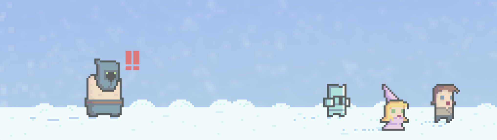
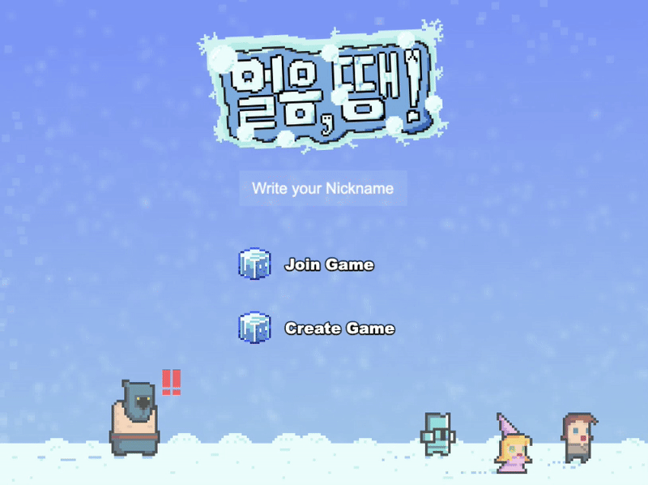
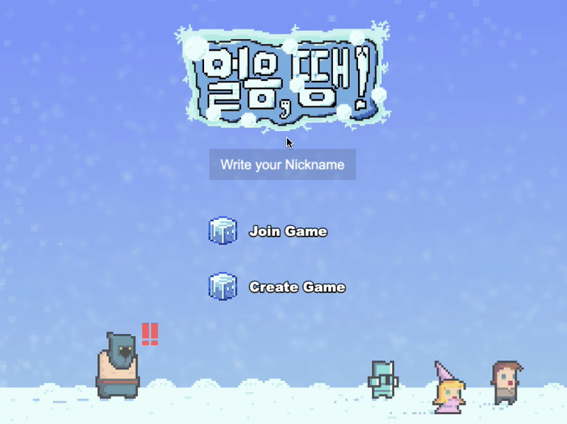
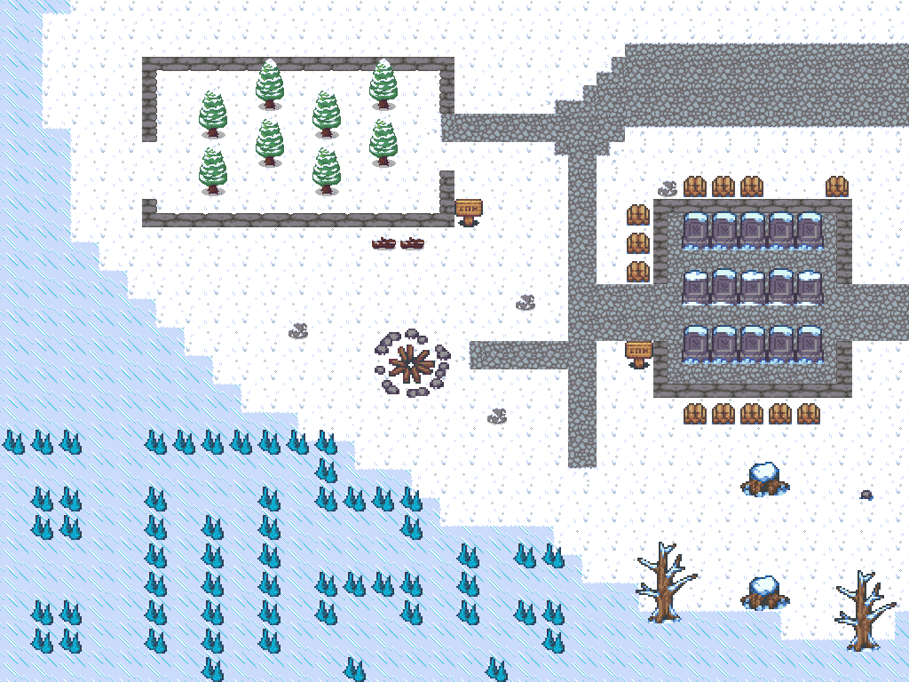
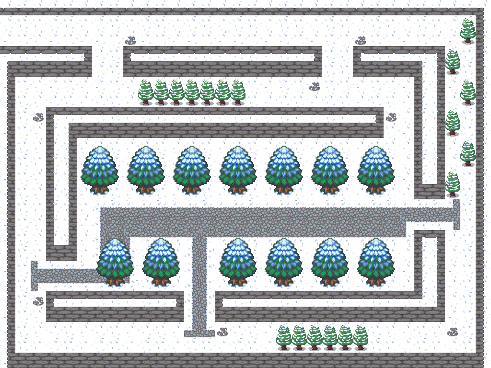
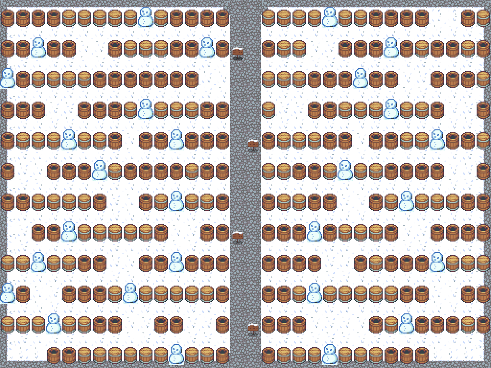
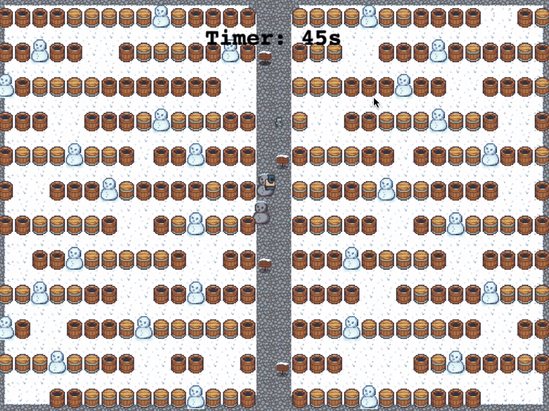

# 🧊 얼음, 땡 !

<!--배지-->
![Repository Size][repository-size-shield]

<!--프로젝트 대문 이미지-->



## 📦 버전 기록 (Changelog)

#### v1.1.0 (2025-06-09)
- PostgreSQL 연결 설정 개선
- Docker 환경에서 동작하게끔 변경
- api 주소 .env로 이전

#### v1.0.0 (2025-01-01)
- 기본 4인 멀티 게임 구축 완료


# [1] About the Project

- **몰입캠프 2주차 프로젝트**
- Phaser를 사용하여 Typescript기반의 웹 게임 제작해보기

## Features
- 보통 Unity3D로 게임 작업을 하는 것과는 다르게, 웹 상으로 구동이 가능하다.

- 4명에서 즐길수 있는 2d 도트 게임을 제작했으며, 맵을 제외한 모든 픽셀 그림들은 직접 제작하여 사용했다.

## Tech Stack

- [Phaser](https://phaser.io/) 3.87.0
- [Svelte](https://svelte.dev/) 4.2.17
- [Vite](https://vite.dev/) 5.2.11
- [Typescript](https://www.typescriptlang.org/) 5.4.5
- [Express.js](https://expressjs.com/) 4.21.2
- [PostgreSQL](https://www.postgresql.org/) 8.13.1


# [2] Getting Started


## Installation

```bash
git clone https://https://github.com/Ea3124/MadCamp2ndWeek

# 시작
$ docker-compose up --build -d

# 종료시
$ docker compose down --volumes --remove-orphans
```

- Docker Compose version v2.35.1-desktop.1

## Configuration

- nothing for configuration


# [3] 게임 소개

<aside>

### 🧊 감성돋는 픽셀 인트로

</aside>



- **인터랙티브 버튼**: 마우스 오버 및 클릭 시 시각적 효과 제공.
- **닉네임 입력 시스템**: 클릭 및 키보드 입력을 통한 사용자 닉네임 설정.
- **실시간 타이틀 애니메이션**: 마우스 움직임에 따라 로고가 부드럽게 기울어지는 효과.
- **씬 간 데이터 전달**: 닉네임 및 방 정보를 다음 씬으로 전달하여 원활한 사용자 경험 제공.

<aside>

### 🧊 다같이 게임해요! - Create Game

</aside>




Map1


Map2


Map3

- **입력 필드 인터랙션**: 방 이름과 비밀번호 입력 필드를 클릭하여 활성화하고, 키보드 입력을 통해 텍스트를 입력할 수 있습니다.
- **맵 선택 시스템**: 사용자가 제공된 맵 목록 중에서 하나를 선택할 수 있으며, 선택된 맵은 시각적으로 강조됩니다.
- **서버 통신 연동**: 방 생성 요청을 서버에 전송하고, 서버로부터의 응답을 처리하여 성공 시 `WaitingRoom` 씬으로 전환합니다.
- **커스텀 폰트 적용**: `Rubik Pixels`와 `Jua` 폰트를 사용하여 텍스트의 시각적 스타일을 향상시킵니다.
- **이벤트 버스 통신**: 씬 준비 완료를 다른 모듈에 알리기 위해 이벤트 버스를 사용합니다.

<aside>

### 🧊 다같이 게임해요! - Join Game

</aside>


- **방 목록 표시 및 관리**: 서버로부터 수신한 현재 활성화된 방 목록을 화면에 동적으로 표시하고, 실시간으로 업데이트합니다.
- **방 선택 시스템**: 사용자가 원하는 방을 선택할 수 있으며, 선택된 방은 시각적으로 강조됩니다.
- **비밀번호 보호 방 참가**: 비밀번호가 필요한 방을 선택할 경우, 비밀번호 입력 팝업을 통해 보안을 강화합니다.
- **인터랙티브 버튼**: "Join Room!" 버튼 및 방 목록의 각 방 버튼에 마우스 오버 및 클릭 시 시각적 효과를 제공합니다.
- **서버 통신 연동**: 방 목록 요청, 방 참가 요청 등을 서버에 전송하고, 서버로부터의 응답을 처리하여 성공 시 `WaitingRoom` 씬으로 전환합니다.
- **이벤트 버스 활용**: 다른 모듈(Svelte 애플리케이션 등)과의 이벤트 통신을 통해 비밀번호 입력 팝업을 제어합니다.

<aside>

### 🧊 맵에서 자유롭게, 모두 다같이  놀기 -Game

</aside>


- **실시간 멀티플레이어 관리**: 서버와의 실시간 통신을 통해 여러 플레이어가 동시에 게임에 참여하고 상호작용할 수 있습니다.
- **플레이어 상태 관리**: 플레이어의 움직임, 얼음 상태, 탈락 상태 등을 관리하여 게임의 흐름을 제어합니다.
- **타이머 및 게임 진행 관리**: 게임 시작 시 오버레이를 표시하고, 술래의 움직임 제한과 전체 게임 타이머를 관리합니다.
- **입력 및 움직임 처리**: 키보드 입력을 통해 플레이어의 움직임을 제어하고, 서버와의 동기화를 통해 다른 플레이어의 움직임을 반영합니다.
- **충돌 및 상호작용 처리**: 플레이어 간의 충돌을 감지하고, 서버에 관련 이벤트를 전송하여 게임 로직을 유지합니다.
- **사용자 인터페이스 오버레이**: 게임 시작과 종료 시 어둑한 배경과 텍스트를 통해 사용자에게 현재 상태를 시각적으로 전달합니다.
- **서버와의 데이터 동기화**: 플레이어의 위치, 상태 변경, 게임 진행 상황 등을 서버와 주고받으며 일관된 게임 상태를 유지합니다.

<aside>

### 🧊 게임 끝! 나의 랭킹은?

</aside>



- **랭킹 보드 표시**: 서버에서 가져온 사용자 데이터를 기반으로 상위 10명의 플레이어 랭킹을 화면에 표시합니다.
- **데이터 정렬 및 표시**: 점수를 기준으로 데이터를 정렬하고, 시각적으로 명확하게 랭킹 정보를 제공합니다.

---


# [4] Team Introduce

|Backend & UI|Backend & Map Design|
|:---:|:---:|
|  |  |
|[이승재](https://github.com/Ea3124)|[안지언](https://github.com/jieon814)|
|leesj6717@gmail.com| maria6645@naver.com |

 
<!--Url for Badges-->
[repository-size-shield]: https://img.shields.io/github/repo-size/Ea3124/MadCamp2ndWeek?labelColor=D8D8D8&color=BE81F7
